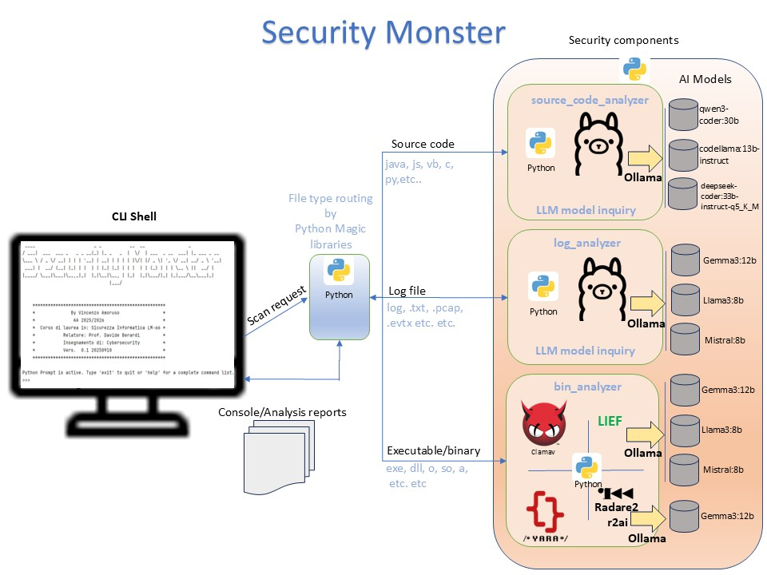

## Security Monster AI
<p align="center">
  
</p>

### Questo repository è collegato al progetto software per la tesi di laurea magistrale di Vincenzo Amoruso dell'AA 2025/26 della **Universitas Mercatorum**
### Corso di laurea in : ***Cybersecurity LM-66***
### Relatore : ***Prof. Davide Berardi***
### Insegnamento di : ***Cybersecuirty***
### Titolo della tesi : ***Applicazione di Modelli Linguistici Locali nell’Analisi Predittiva delle Minacce Informatiche: Un Approccio basato sull’Intelligenza Artificiale***
### Obiettivo: ***Il progetto applica con esempi pratici alla Cybersecuiry alcune delle potenzialità della intelligenza artificiale.***

## Schema progetto e tecnologie

###



<div align="left">
 
  
</div>

---

## Preparazione ambiente per build con Python  

### - Installare Python, scaricabile dal seguente link (Abbiamo selezionato la versione Windows a 64bit)
[https://www.python.org/ftp/python/3.10.4/python-3.10.4-amd64.exe](https://www.python.org/ftp/python/3.10.4/python-3.10.4-amd64.exe)
### - Creare l'ambiente virtuale Python del server con il comando
    python -m venv D:\SecurityMonster
### - Attivare l'ambiente virtuale 
    D:\SecurityMonster\Scripts\activate 
### - Copiare tutti i files scaricati dal repository remoto GitHub nella cartella dell'ambiente virtuale locale.
    cd D:\SecurityMonster
    git clone https://github.com/vamoruso/SecurityMonsterAI.git
    
### - Nell'ambiente virtuale *(venv) D:\SecurityMonster*  eseguire il comando per installare tutti i pacchetti necessari
    pip install requirements.txt 

### - Nell'ambiente virtuale *(venv) D:\SecurityMonster*  eseguire il comando pyinstaller per creare il file SecurityMonster.exe nella cartella *D:\SecurityMonster\dist*
    pyinstaller SecurityMonster.spec --clean 

---

## 🚀 Integrazione di Ollama

### Installazione
Scarica e installa Ollama per Windows 64 bit: https://ollama.com/download/OllamaSetup.exe

## ⚡ Uso di Ollama da CLI

Dopo aver installato Ollama, eseguire comandi direttamente da terminale (PowerShell o CMD) per scaricare i modelli necessari al progetto.

### Scarico modelli utilizzati per il framework
```console
C:\>ollama pull deepseek-coder:33b-instruct-q5_K_M
C:\>ollama pull codellama:13b
C:\>ollama pull qwen3-coder:30b
C:\>ollama pull gemma3:12b
C:\>ollama pull llama3:8b
C:\>ollama pull mistral:latest
```

> [!NOTE]
> Ollama deve essere installato ed il server deve essere in ascolto sulla porta 11434 all'indirizzo https://localhost:11434 <br/>

---

## 🚀 Integrazione di ClamAV

### Installazione
Scarica e installa ClamAV per Windows 64 bit: https://www.clamav.net/downloads/production/clamav-1.4.3.win.x64.msi

> [!NOTE]
> ClamAV deve essere installato ed il server deve essere in ascolto sulla porta 3310 all'indirizzo https://localhost:3310 

---

## 🔍 Installazione di Radare2 e r2ai

### 1. Scaricare Radare2
Scarica l’ultima versione stabile di Radare2 per Windows 64 bit: https://github.com/radareorg/radare2/releases/download/6.0.4/radare2-6.0.4-w64.zip


Estrai lo zip e aggiungi la cartella `radare2` al tuo **PATH** di sistema per poter usare il comando `r2` da terminale.


### 2. Scaricare r2ai
Scarica il plugin r2ai: https://github.com/radareorg/r2ai/releases/download/1.2.2/r2ai-1.2.2-windows-latest-meson.zip

All’interno dello zip troverai i file:
- `libr2ai.dll`
- `decai.r2.js`

Copiali nella directory dei plugin di Radare2:
%USER_HOME%\.local\share\radare2\plugins

---

## Guida d'uso per eseguibile SecurityMonster.exe.   

| Componente   | Descrizione                        | Esempio                                                                 |
|--------------|------------------------------------|-------------------------------------------------------------------------|
| Executable   | Il file che avvia il programma     | `SecurityMonster.exe` <br> `SecurityMonster.py`                         |
| Subcommand   | Azione da eseguire                 | `scan`, `help`                                                          |
| Target       | Il file, directory o URL da analizzare | `C:\malware.exe` <br> `../samples` <br> `https://example.org`        |
| Parameters   | Opzioni di elaborazione            | `--type src` → analisi file sorgenti <br> `--type bin` → analisi file eseguibili <br> `--type log` → analisi file log <br> `--version` → visualizza versione <br> `--no-banner` → nasconde banner iniziale |

---

## Tabelle e screenshots dei test effettuati

### SecurityMonster analisi codice sorgente

### Tabella 4.1: Elenco vulnerabilità innestate – primo caso d'uso (file test.js)

| Tipo                          | Descrizione                                                                                                              | Gravità |
|-------------------------------|--------------------------------------------------------------------------------------------------------------------------|---------|
| XSS                           | DOM-based XSS tramite inserimento diretto nel DOM senza sanitizzazione.                                                  | Alta    |
| CSRF                          | Richiesta automatica verso endpoint critico senza token CSRF.                                                            | Media   |
| Eval injection                | Esecuzione dinamica di codice utente tramite `eval()`.                                                                   | Alta    |
| Prototype Pollution           | Manipolazione dell’oggetto `proto` tramite JSON non sicuro.                                                              | Alta    |
| Insecure Access               | Manipolazione diretta del DOM con ID controllato da input utente.                                                        | Media   |
| Hardcoded Secrets             | Presenza di chiavi API hardcoded nel codice sorgente.                                                                    | Alta    |
| Errore assegnazione           | Errore logico: assegnazione anziché test.                                                                                | Alta    |
| Loop infinito                 | Errore logico: loop infinito per incremento errato.                                                                      | Alta    |
| Keylogger                     | Intercetta ogni pressione di tasto e invia i dati a un server remoto. È un esempio classico di violazione della privacy.  | Alta    |
| Esfiltrazione                 | Sfrutta un’immagine invisibile per inviare i cookie dell’utente a un dominio esterno, bypassando restrizioni CORS.       | Alta    |

Comando per scansione file test.js:
```console
D:\SecurityMonster\dist>SecurityMonster.exe scan ../samples/test.js --type src
```    


### Tabella 4.2: Risultati vulnerabilità rilevate nel file test.js dai modelli IA

| Tipo / Modello         | Qwen3-Coder | CodeLlama | Deepseek-Coder |
|------------------------|:-----------:|:---------:|:--------------:|
| XSS                    |      ✔      |     ✔     |        ✗       |
| CSRF                   |      ✔      |     ✔     |        ✔       |
| Eval injection         |      ✔      |     ✗     |        ✗       |
| Prototype Pollution    |      ✔      |     ✔     |        ✔       |
| Insecure DOM Access    |      ✔      |     ✔     |        ✔       |
| Hardcoded Secrets      |      ✔      |     ✔     |        ✔       |
| Errore assegnazione    |      ✔      |     ✔     |        ✔       |
| Loop infinito          |      ✔      |     ✔     |        ✗       |
| Keylogger              |      ✔      |     ✔     |        ✔       |
| Esfiltrazione          |      ✔      |     ✗     |        ✔       |

- **Qwen3-Coder**: 9/10 → 90%  
- **CodeLlama**: 8/10 → 80%  
- **Deepseek-Coder**: 7/10 → 70%


### Tabella 4.3: Elenco vulnerabilità secondo caso d’uso (directory ./samples/source)

| Nome File                  | Tipo di Problema                          | Gravità |
|----------------------------|-------------------------------------------|---------|
| BrokenAuth.java            | Broken Authentication                     | Alta    |
| InsecureCSRFHandler.cs     | Cross-Site Request Forgery (CSRF)         | Alta    |
| InsecureDeserialization.py | Insecure Deserialization                  | Alta    |
| SensitiveDataExposure.c    | Cryptographic Failures                    | Media   |
| SqlInjection.java          | Injection (SQLi)                          | Alta    |
| UnvalidatedRedirect.java   | Unvalidated Redirects                     | Media   |
| UnsafeArray.c              | Buffer Overflow / Memory Corruption       | Alta    |
| UnsafeInput.c              | Improper Input\Validation                 | Media   |
| UnsafeSerialization.java   | Insecure Deserialization                  | Alta    |
| UnsafeShell.py             | Command Injection                         | Alta    |

Comando per scansione directory:
```console
D:\SecurityMonster\dist>SecurityMonster.exe scan ../samples/source --type src
```

### Tabella 4.4: Riepilogo risultati scansione directory `samples/source`

| Nome File                  | Qwen3-Coder | CodeLlama | Deepseek-Coder |
|----------------------------|:-----------:|:---------:|:--------------:|
| BrokenAuth.java            |      ✔      |     ✗     |        ✔       |
| InsecureCSRFHandler.cs     |      ✔      |     ✔     |        ✔       |
| InsecureDeserialization.py |      ✔      |     ✔     |        ✔       |
| SensitiveDataExposure.c    |      ✔      |     ✔     |        ✔       |
| SqlInjection.java          |      ✔      |     ✔     |        ✔       |
| UnvalidatedRedirect.java   |      ✔      |     ✔     |        ✔       |
| UnsafeArray.c              |      ✔      |     ✔     |        ✔       |
| UnsafeInput.c              |      ✔      |     ✔     |        ✔       |
| UnsafeSerialization.java   |      ✔      |     ✔     |        ✔       |
| UnsafeShell.py             |      ✔      |     ✔     |        ✔       |

- **Qwen3-Coder**: 10/10 → 100%  
- **CodeLlama**: 9/10 → 90%  
- **Deepseek-Coder**: 10/10 → 100%


Comando per scansione sito web  https://vamoruso.github.io/SecurityMonsterAI/:
```console
D:\SecurityMonster\dist>SecurityMonster.exe scan  https://vamoruso.github.io/SecurityMonsterAI/ --type src
```

### Tabella 4.5: Riepilogo vulnerabilità sito web contenente file `vulnerable-utils.js`

| Vulnerabilità              | Descrizione                                                                                                                               | Gravità  |
|----------------------------|-------------------------------------------------------------------------------------------------------------------------------------------|----------|
| Reflected XSS              | Iniezione di script riflesso tramite parametri URL non sanitizzati.                                                                       | Critica  |
| DOM-Based XSS              | Manipolazione del DOM lato client che consente l’esecuzione di codice malevolo.                                                          | Critica  |
| innerHTML con input utente | Uso diretto di `innerHTML` con dati non validati, causa XSS.                                                                              | Alta     |
| SQL Injection (simulato client-side) | Simulazione di query SQL vulnerabili lato client, utile per test didattici.                                                  | Media    |
| Hardcoded Credentials      | Credenziali statiche nel codice sorgente, facilmente estraibili.                                                                          | Alta     |
| Sensitive Data Exposure    | Dati sensibili esposti in chiaro, accessibili da terzi.                                                                                  | Alta     |
| IDOR                       | Accesso non autorizzato a risorse tramite ID manipolabili.                                                                               | Critica  |
| Insecure Random            | Uso di generatori di numeri casuali non crittograficamente sicuri.                                                                       | Media    |
| Local Storage con dati sensibili | Archiviazione di informazioni riservate nel `localStorage`, esposte a JavaScript.                                                | Alta     |
| Eval con input utente (estremo) | Esecuzione dinamica di codice tramite `eval`, altamente pericolosa.                                                           | Critica  |

### Tabella 4.6: Riepilogo vulnerabilità scansione `vulnerable-utils.js`

| Vulnerabilità                                      | Qwen3-Coder | CodeLlama | Deepseek-Coder |
|----------------------------------------------------|:-----------:|:---------:|:--------------:|
| Reflected XSS                                      |      ✔      |     ✗     |        ✔       |
| DOM-Based XSS                                      |      ✔      |     ✗     |        ✔       |
| innerHTML con input utente                         |      ✔      |     ✗     |        ✔       |
| SQL Injection (simulato client-side)               |      ✔      |     ✔     |        ✔       |
| Hardcoded Credentials                              |      ✔      |     ✗     |        ✔       |
| Sensitive Data Exposure                            |      ✔      |     ✗     |        ✔       |
| Insecure Direct Object Reference (IDOR)            |      ✔      |     ✗     |        ✔       |
| Insecure Random                                    |      ✔      |     ✗     |        ✔       |
| Local Storage con dati sensibili                   |      ✔      |     ✗     |        ✔       |
| Eval con input utente (estremo)                    |      ✔      |     ✗     |        ✗       |

- **Qwen3-Coder**: 10/10 → 100%  
- **CodeLlama**: 1/10 → 10%  
- **Deepseek-Coder**: 9/10 → 90%

### Tabella 4.7: Riepilogo vulnerabilità innestatesito web contenente file `styles.css`

| ID | Descrizione                                                                 |
|----|-----------------------------------------------------------------------------|
| 1  | Commenti con informazioni sensibili                                         |
| 2  | Internal paths disclosure                                                   |
| 3  | CSS Injection vulnerability                                                 |
| 4  | Keylogger via CSS (attribute selector attack)                               |
| 5  | Data exfiltration via CSS                                                   |
| 6  | CSS-based timing attack                                                     |
| 7  | Clickjacking helper styles                                                  |
| 8  | Mixed content – HTTP resources                                              |
| 9  | CSS Injection point per Unicode tricks                                      |
| 10 | Sensitive class names che rivelano logica business                          |
| 11 | Debug styles lasciati in produzione                                         |
| 12 | CSS che espone internal structure                                           |
| 13 | Sourcemap disclosure                                                        |
| 14 | `@import` da fonte non verificata                                           |
| 15 | CSS variables con valori sensibili                                          |
| 16 | `Expression()` for IE (code execution in old IE)                            |
| 17 | Behavior binding (IE specific)                                              |
| 18 | CSS filters che possono essere abusati                                      |
| 19 | User tracking via background image                                          |
| 20 | CSS timing attacks                                                          |
| 21 | Malicious `@font-face`                                                      |
| 22 | Viewport-based information disclosure                                       |
| 23 | CSS con backdoor per phishing                                               |
| 24 | Malicious CSS counters                                                      |
| 25 | CSS-based CAPTCHA bypass hints                                               |
| 26 | Unicode tricks in content                                                   |
| 27 | Z-index wars per clickjacking                                               |

###  Categorizzazione delle 27 vulnerabilità del file styles.css

- **Injection (Code)**: 10 (37.0%)
- **Information Leak**: 8 (29.6%)
- **IE-specific Exploits**: 4 (14.8%)
- **Tracking & Privacy**: 2 (7.4%)
- **Clickjacking**: 2 (7.4%)
- **Timing**: 1 (3.8%)

Risultati scansione file style.css del sito  https://vamoruso.github.io/SecurityMonsterAI/:


<table>
<tr>
<td> </td>
<td> </td>
<td> </td>
<td> </td>
<td> </td>
<td> </td>
<td> </td>
<td> </td>
<td> </td>
<td> </td>
<td> </td>
</tr>  
</table>

---
### SecurityMonster analisi logs

Comando per scansione file log didattici inseriti nella directory ../samples/log/mitre_list:
```console
D:\SecurityMonster\dist>SecurityMonster.exe scan  ../samples/log/mitre_list --type log
```

### Tabella 5.1: Tattiche MITRE ATT&CK con esempi di file log simulati per analisi

| Tattica MITRE ATT&CK       | Descrizione                                                                 | Gravità  | File simulato                             |
|----------------------------|-----------------------------------------------------------------------------|----------|-------------------------------------------|
| **Reconnaissance**         | Raccolta di informazioni sul target (domini, IP, servizi esposti).         | Media    | `01 Reconnaissance.txt`                   |
| **Resource Development**   | Preparazione di risorse per l’attacco (domini, malware, credenziali).      | Media    | `02 Resource Development.log`             |
| **Initial Access**         | Primo ingresso nel sistema tramite phishing, exploit o credenziali rubate. | Alta     | `03 Initial Access.pcap`                  |
| **Execution**              | Esecuzione di codice malevolo su sistema compromesso.                      | Alta     | `04 PowerShell script execution.evtx`     |
| **Persistence**            | Mantenimento dell’accesso dopo reboot o cambio credenziali.                | Alta     | `05 Persistence.evtx`                     |
| **Privilege Escalation**   | Acquisizione di permessi elevati (admin/root).                             | Alta     | `06 Privilege Escalation.evtx`            |
| **Defense Evasion**        | Tecniche per evitare rilevamento (offuscamento, disattivazione antivirus). | Alta     | `07 Defense Evasion.evtx`                 |
| **Credential Access**      | Furto di credenziali (dump, keylogging, brute force).                      | Alta     | `08 Credential Access.evtx`               |
| **Discovery**              | Mappatura dell’ambiente compromesso (host, utenti, servizi).               | Media    | `09 Discovery.log`                        |
| **Lateral Movement**       | Spostamento tra sistemi nella rete per espandere il controllo.             | Alta     | `10 Lateral movement.log`                 |
| **Collection**             | Raccolta di dati sensibili (documenti, credenziali, audio).                | Alta     | `11 Collection.log`                       |
| **Command and Control**    | Comunicazione con sistemi compromessi per impartire comandi.               | Alta     | `12 Command and Control.pcap`             |
| **Exfiltration**           | Estrazione di dati verso l’esterno (FTP, HTTP, DNS).                       | Critica  | `13 Exfiltration.pcap`                    |
| **Impact**                 | Manipolazione o distruzione di dati e sistemi.                             | Critica  | `14 Impact.evtx`                          |

<table>
   <tr>
<td> </td>
<td> </td>
<td> </td>
<td> </td>
<td> </td>
<td> </td>
<td> </td>
<td> </td>
<td> </td>
<td> </td>
</tr><tr>
<td> </td>
<td> </td>
<td> </td>
<td> </td>
<td> </td>
<td> </td>
<td></td> 
<td></td> 
<td></td> 
<td></td> 
   </tr>
</table>  
    
### SecurityMonster analisi binary ed eseguibili
<table>
<tr>
<td> </td> 
<td> </td> 
<td> </td> 
<td> </td> 
<td> </td> 
<td> </td> 
<td> </td> 
<td> </td> 
<td> </td> 
<td> </td> 
</tr><tr>
<td> </td> 
<td> </td> 
<td> </td> 
<td> </td> 
<td> </td> 
<td> </td> 
<td> </td> 
<td> </td> 
<td> </td> 
<td> </td> 
</tr><tr>
<td> </td> 
<td> </td> 
<td> </td> 
<td> </td> 
<td> </td> 
<td> </td> 
<td> </td> 
<td> </td> 
<td> </td> 
</tr><tr>
<td> </td> 
<td> </td> 
<td> </td> 
<td> </td> 
<td> </td> 
<td></td> 
<td></td> 
<td></td> 
<td></td> 
<td></td> 
</tr>  
</table>   

###

## Credits

### Media

• Tutti gli screenshot del codice utilizzato in questo README sono stati realizzati da me su dispostivo Windows 11 a 64bit 32GB RAM Processore	Intel(R) Core(TM) i7-8750H CPU @ 2.20GHz, 2208 Mhz, 6 core, 12 processori logici

### Ringraziamenti
* ***Pancake***
* ***Prof. Davide Berardi***
* [Radare2](https://github.com/radareorg/radare2).
* [R2ai](https://github.com/radareorg/r2ai)


---
###

<h2 align="left">Vincenzo Amoruso <cite>2025</cite></h2>


      


